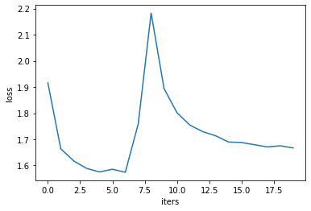

# Character-Level-Recurrent-Neural-Networks-Trained-on-Various-Datasets-for-Writing-Style-Replication
---
title: "Character-Level Recurrent Neural Networks Trained on Various Datasets for Writing Style Replication"
author: "WonJae Lee"
email: "wolee@ucsd.edu"
affiliation: "University of California, San Diego"
editor: "N/A"
firstpageno: 1
---

# Character-Level Recurrent Neural Networks Trained on Various Datasets for Writing Style Replication

## WonJae Lee
University of California, San Diego
wolee@ucsd.edu

## Abstract

This report explores the application of Recurrent Neural Networks (RNNs), specifically Long Short-Term Memory (LSTM) networks, for generating text from various datasets including Shakespeare, Sherlock Holmes, "The Catcher in the Rye", and Wikipedia. The goal is to develop models capable of producing coherent and contextually relevant text that mimics the style and content of the original datasets. Two character-level RNN implementations were employed: one trained on the literary works and another on the Wikipedia dataset. Despite the character-level focus, which might occasionally produce nonsensical words, both models are expected to generate outputs that resemble the style and content of the original texts to some degree.

## Introduction

The field of text generation has seen substantial advancements with the development of large language models like ChatGPT. Among various models for handling sequential data, RNNs, particularly their LSTM variants, are noted for their effectiveness in capturing long-range dependencies crucial for language modeling. Inspired by Andrej Karpathy’s blog post "The Unreasonable Effectiveness of Recurrent Neural Networks" [1], this project aims to replicate and extend his findings to various literary and informational texts, highlighting the nuances involved in training deep learning models on stylistically diverse data.

The simplicity and effectiveness of char-RNNs, as demonstrated by various experiments, highlight their potential in generating realistic and contextually relevant text. This project aims to replicate and extend these findings within the context of each training text, providing insights into the robustness of char-RNNs in generating coherent and contextually appropriate text.

## Method

### Model

Character-Level RNNs (char-RNNs) generate text one character at a time. This approach involves training the RNN on a corpus of text where the model learns to predict the next character in a sequence given the characters that came before it. The "character-level" aspect refers to the granularity at which the model operates; unlike word-level models that handle larger chunks of text (whole words), char-RNNs work with the smallest units of text—individual characters. This allows char-RNNs to capture the nuances of language syntax and structure at a very detailed level, including punctuation, capitalization, and formatting. With these capabilities, we can reasonably expect them to replicate the styles of input writing.

Karpathy gives an example of char-RNN to easily grasp the concept of char-RNN. In practical terms, consider a simple example with a vocabulary of four letters: “h”, “e”, “l”, and “o”. Training the RNN on the sequence “hello” involves treating it as four separate training examples. For instance, the probability of “e” is predicted given the context of “h”, “l” is predicted given “he”, and so on. Each character in the sequence is encoded as a one-hot vector, where the position corresponding to the character is set to 1, and all other positions are 0.

During training, the RNN receives these one-hot encoded vectors sequentially and outputs a probability distribution over the vocabulary. For example, when the RNN processes the character “h”, it assigns a confidence score to the probability of each possible next character. The model learns to adjust its weights through backpropagation, a process that involves computing gradients and updating weights to minimize the difference between predicted and actual next characters. This iterative process continues until the network's predictions align with the training data.

At test time, the RNN generates text by sampling from the output distribution. It begins with an initial character, samples the next character, and feeds this character back into the network to generate the subsequent character. This loop continues, producing a sequence of text that mimics the training data's style and content.

The training process typically involves the use of a Softmax classifier for output probabilities and optimization techniques like Stochastic Gradient Descent (SGD) or advanced methods such as RMSProp or Adam, which help stabilize the learning process. The model’s ability to maintain context across sequences is critical, as it must rely on its recurrent connections to keep track of the context and generate coherent text.

Two models are used: one with a simpler implementation using Python's torch library, which is used to train on three literature, and a more complex one using Tensorflow, which is used to train on the Wikipedia data. The Tensorflow implementation of char-RNN used in this project is created by Oleksii Trekhleb [2].

### Dataset

The datasets consist of 4 different texts: Shakespeare, Sherlock Holmes, The Catcher in the Rye, and Wikipedia data from March 1st, 2019. A more recent dataset of Wikipedia would have been better in terms of precision, accuracy, and probably performance of the model, but this past Wikipedia dataset was chosen because of resource constraints, as more recent Wikipedia datasets are about 30% larger in file size. With the limited computational and storage resources I have, using the past dataset was a trade-off decision between larger and more recent data and resource availability.

### Data Preprocessing

For the torch model, it first gets a random sequence of the dataset, converts the sequence to one-hot tensor, converts the sequence to index tensor, and then samples a mini-batch including input tensor and target tensor.

While the Tensorflow model follows a similar process, it vectorizes the input and creates training sequence in the process.

### Training

For the torch model, the training is done over 100,000 iterations through RNN hidden layer and linear output layer with 100 hidden layer size and the number of unique characters in the data as the output layer size. Adam and cross-entropy loss is used as the optimizer and loss function.

For the Tensorflow model, Adam is also chosen as the optimizer, but sparse categorical cross-entropy is chosen as the loss function. The model is trained on the Wikipedia dataset over 150 epochs through an embedding layer with 158,976 parameters, LSTM layer with 5,246,976 parameters, and dense layer with 636,525 parameters.

## Experiment

The torch model is trained on Shakespeare, Sherlock Holmes, and The Catcher in the Rye texts. And they were trained over 100,000 iterations, which were a lot more than the original experiment design. This will improve the performance of the char-RNN in capturing the style and content of the input text data. Then, the model was used to generate sample text for evaluation.

The Tensorflow model was trained over 150 epochs with 10 steps per epoch. Then, the model was saved and used to generate the sample text following the input text for evaluation.

### Evaluation

For the evaluation for the torch model, a generated sample sequence of 600 length was generated to see the results. For the torch model trained on The Catcher in the Rye text, the training loss over iterations and the generated sample sequence was:

