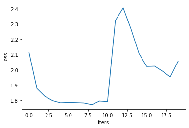
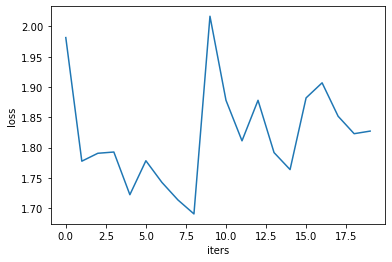
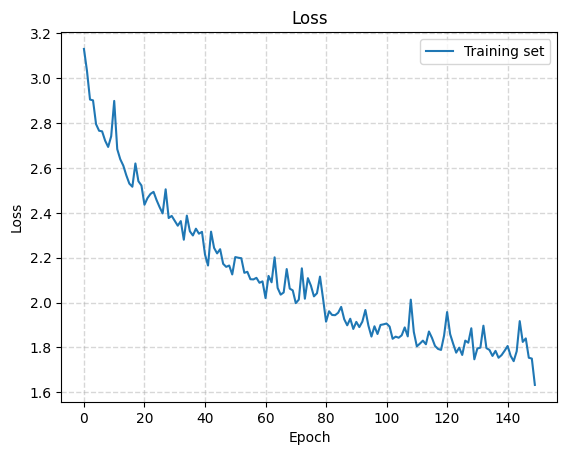

# Character-Level-Recurrent-Neural-Networks-Trained-on-Various-Datasets-for-Writing-Style-Replication
---
title: "Character-Level Recurrent Neural Networks Trained on Various Datasets for Writing Style Replication"
author: "WonJae Lee"
email: "wolee@ucsd.edu"
affiliation: "University of California, San Diego"
editor: "N/A"
firstpageno: 1
---

# Character-Level Recurrent Neural Networks Trained on Various Datasets for Writing Style Replication

## WonJae Lee
University of California, San Diego
wolee@ucsd.edu

## Abstract

This report explores the application of Recurrent Neural Networks (RNNs), specifically Long Short-Term Memory (LSTM) networks, for generating text from various datasets including Shakespeare, Sherlock Holmes, "The Catcher in the Rye", and Wikipedia. The goal is to develop models capable of producing coherent and contextually relevant text that mimics the style and content of the original datasets. Two character-level RNN implementations were employed: one trained on the literary works and another on the Wikipedia dataset. Despite the character-level focus, which might occasionally produce nonsensical words, both models are expected to generate outputs that resemble the style and content of the original texts to some degree.

## Introduction

The field of text generation has seen substantial advancements with the development of large language models like ChatGPT. Among various models for handling sequential data, RNNs, particularly their LSTM variants, are noted for their effectiveness in capturing long-range dependencies crucial for language modeling. Inspired by Andrej Karpathy’s blog post "The Unreasonable Effectiveness of Recurrent Neural Networks" [1], this project aims to replicate and extend his findings to various literary and informational texts, highlighting the nuances involved in training deep learning models on stylistically diverse data.

The simplicity and effectiveness of char-RNNs, as demonstrated by various experiments, highlight their potential in generating realistic and contextually relevant text. This project aims to replicate and extend these findings within the context of each training text, providing insights into the robustness of char-RNNs in generating coherent and contextually appropriate text.

## Method

### Model

Character-Level RNNs (char-RNNs) generate text one character at a time. This approach involves training the RNN on a corpus of text where the model learns to predict the next character in a sequence given the characters that came before it. The "character-level" aspect refers to the granularity at which the model operates; unlike word-level models that handle larger chunks of text (whole words), char-RNNs work with the smallest units of text—individual characters. This allows char-RNNs to capture the nuances of language syntax and structure at a very detailed level, including punctuation, capitalization, and formatting. With these capabilities, we can reasonably expect them to replicate the styles of input writing.

Karpathy gives an example of char-RNN to easily grasp the concept of char-RNN. In practical terms, consider a simple example with a vocabulary of four letters: “h”, “e”, “l”, and “o”. Training the RNN on the sequence “hello” involves treating it as four separate training examples. For instance, the probability of “e” is predicted given the context of “h”, “l” is predicted given “he”, and so on. Each character in the sequence is encoded as a one-hot vector, where the position corresponding to the character is set to 1, and all other positions are 0.

During training, the RNN receives these one-hot encoded vectors sequentially and outputs a probability distribution over the vocabulary. For example, when the RNN processes the character “h”, it assigns a confidence score to the probability of each possible next character. The model learns to adjust its weights through backpropagation, a process that involves computing gradients and updating weights to minimize the difference between predicted and actual next characters. This iterative process continues until the network's predictions align with the training data.

At test time, the RNN generates text by sampling from the output distribution. It begins with an initial character, samples the next character, and feeds this character back into the network to generate the subsequent character. This loop continues, producing a sequence of text that mimics the training data's style and content.

The training process typically involves the use of a Softmax classifier for output probabilities and optimization techniques like Stochastic Gradient Descent (SGD) or advanced methods such as RMSProp or Adam, which help stabilize the learning process. The model’s ability to maintain context across sequences is critical, as it must rely on its recurrent connections to keep track of the context and generate coherent text.

Two models are used: one with a simpler implementation using Python's torch library, which is used to train on three literature, and a more complex one using Tensorflow, which is used to train on the Wikipedia data. The Tensorflow implementation of char-RNN used in this project is created by Oleksii Trekhleb [2].

### Dataset

The datasets consist of 4 different texts: Shakespeare, Sherlock Holmes, The Catcher in the Rye, and Wikipedia data from March 1st, 2019. A more recent dataset of Wikipedia would have been better in terms of precision, accuracy, and probably performance of the model, but this past Wikipedia dataset was chosen because of resource constraints, as more recent Wikipedia datasets are about 30% larger in file size. With the limited computational and storage resources I have, using the past dataset was a trade-off decision between larger and more recent data and resource availability.

### Data Preprocessing

For the torch model, it first gets a random sequence of the dataset, converts the sequence to one-hot tensor, converts the sequence to index tensor, and then samples a mini-batch including input tensor and target tensor.

While the Tensorflow model follows a similar process, it vectorizes the input and creates training sequence in the process.

### Training

For the torch model, the training is done over 100,000 iterations through RNN hidden layer and linear output layer with 100 hidden layer size and the number of unique characters in the data as the output layer size. Adam and cross-entropy loss is used as the optimizer and loss function.

For the Tensorflow model, Adam is also chosen as the optimizer, but sparse categorical cross-entropy is chosen as the loss function. The model is trained on the Wikipedia dataset over 150 epochs through an embedding layer with 158,976 parameters, LSTM layer with 5,246,976 parameters, and dense layer with 636,525 parameters.

## Experiment

The torch model is trained on Shakespeare, Sherlock Holmes, and The Catcher in the Rye texts. And they were trained over 100,000 iterations, which were a lot more than the original experiment design. This will improve the performance of the char-RNN in capturing the style and content of the input text data. Then, the model was used to generate sample text for evaluation.

The Tensorflow model was trained over 150 epochs with 10 steps per epoch. Then, the model was saved and used to generate the sample text following the input text for evaluation.

### Evaluation

For the evaluation for the torch model, a generated sample sequence of 600 length was generated to see the results. For the torch model trained on The Catcher in the Rye text, the training loss over iterations and the generated sample sequence was:

Whsy onas house meevid-dris,
and sent! You it, he saw it a glad whered anything do a gis nurd much and and
then the like feglle and littt or srandly seen at thisle," she out, when I hard
right thinking. She got I don't dod like with yaice, I dame did evet fuld in feved wire," I so fin! And out he like thid at in the dough, the wasl "Whiding, though, I drived in my picks now, lonell a blarn, ehind of cald all,"
"DoI'd, only didn't and little with me. Age did."
Fine sed in whing, She hot to grousr."
"Wusing thoubly goied like pascaw only. She fell she what was lifed, the should ford, I was sce go

For the torch model trained on the Shakespeare text, the training loss over iterations and the generated sample sequence was:

Whalt af wherd'd oulir heak I yir bee the kid by'd wokiof ind ingn, thr hit,
A
, thim to ty tik apely his dut in off or'd the froundy lin cupe,n
The anll ee cown ancess housilprly; and themen keincin on sioms siseongh
A frert yytb I
re ixs noin, any; oft thoust in to melp frise it!
Lod thin by anournan Bord dichaes-
Fir kin,
Ince you felss hist in herl
I thin Naurswe drre curl;
Thin we purl I?

Fnise see nall thea ou yaysid, lark shast:
A:
Tham the des
, de to the way.
Iuther then rit, and knsnout I dvrter suatINENNDWEN:
As wein say be f ee rring yoW the he daich' wnin you? withutche likem mare

For the torch model trained on the Sherlock Holmes text, the training loss over iterations and the generated sample sequence was:

Well of
susing dim the sidlendied with then dasonee, we was it with
full mes. This
the int
been he the leders. "The dite a my the sivertinesces."

 "When.

 "Thrise the from well.
 "Bulled off.
 "But and
 this answers you came
 hece whering. The ven us notiolte oncemins one he leare it bouser, is the so."

 Their or catt not contning a from to If have
 the terel in the her there, fear migectelues a gaartent be the cruntreged oul
 Lattle me. The rew sirners theke was notiliage in wark the offe of to the heryed the caremet, wisng chordune vi

For the Tensorflow model, the temperature parameter was used to generate different sample texts. Low temperatures result in more predictable text, and higher temperatures result in more surprising text. The length of the generated sample sequences is 300, and the input sequence I choose is "Machine learning is". The training loss over iteration and the generated sample sequence was:

Temperature: 0.2

Machine learning is a series of the competitors of the competition of the program of the first the series of the program and the end of the competitors of the program of the control of the competition of the town of the program of the competitors of the transport of the series of the present of the competitors of the

Temperature: 0.4

Machine learning is entition of the control and the the track of the town the program in the time and the program (born and the carried in 1975 and the took and her competition of the the promation in the Tamo and a resident of the name the transpernation of the competition of the the control of the the first edition

Temperature: 0.6

Machine learning is lost, and 2003 cates, which the close that the program and was an all the first the price the generation of the personal and the charre and were were 10 seconds of the place the definated in a competition of the story of the district of the really carrent in the series, had the film and cape of the

Temperature: 0.8

Machine learning is a region was also resister of the verron, as the gits of the cowernal point to local first in passonicallows and retains and interdates leagues end 1012. The among of sholds sholder and the first many called for was of the end to the 164 potention of the existed transperials wastonis, the told of

Temperature: 1.0

Machine learning is also abdeat in the first also was parties of ence that he had weiled on Selocial in Italian
References

External living costand of the carrently age puip of 15 last ans" from and of the award-the Rabillo), the Program, Interesting Yeari and in championshrio spenddrow was rectiver in munic pase Nei

Temperature: 1.2

Machine learning is weaphing shptriduated that sponf tradition messequiry compex." By Ocurem Ne-symmoned it in the chipitora, polages in reduates, "Moscgop are piká,
Category
Bigisles in the travskre name Innocé't Na Methay""(Novemberatuble, found), equsion, Aurnicg), Brives in,"brotaketrat@Sdrach

Compalved

The Tensorflow model shows a remarkable performance in replicating the writing style of Wikipedia. In the lower temperatures, the sentences look structured although the context lacks relevance and coherence. However, considering that the model was trained on a character-level basis and used very low computation resources that was available, this is a good enough result for a simple char-RNN model.

On the other hand, the torch model trained on different literature seems to work a lot worse than the Tensorflow model. This is, however, expected as the size of data, training time, and complexity of the model are all inferior to the Tensorflow model. Still, there are a few points this model achieves. Although these observations are very subjective as it lacks an objective evaluation model, the model trained on The Catcher in the Rye text seems to output somewhat more modern-conversation-sounding output although most of the output is incomprehensible. The model trained on the Shakespeare text also sounds like some script from Shakespeare plays despite it is pretty much incomprehensible. Similarly, the model trained on the Sherlock Holmes text seems to somewhat replicate the style of the Sherlock Holmes text although it is also largely incomprehensible.

Again, these models lack an objective way of computing the writing style similarity, so the only option for this project is that humans evaluate the similarity by "feels." Although the outputs largely lack coherence, context, and comprehensible words, the torch model seem to be able to replicate the styles of the texts on some level. The Tensorflow model, however, performed much better at generating comprehensible words and sentence structures with lower temperatures. Although it still lacks context and coherence in its outputs, it is surprising how much it can learn on a mere character-level RNN.

## Conclusion

This project demonstrates the potential of char-RNNs in generating text that captures the essence of various literary styles. While the models trained on literary texts managed to emulate distinctive authorial styles to a degree, the Wikipedia-trained model showed a higher proficiency in producing structured and coherent text. The differences in performance across models highlight the impact of training data size, model complexity, and computational resources on text generation capabilities.

### Outcomes

The results from the experiments underscore the versatility and robustness of char-RNNs in text generation tasks. The models trained on literary texts were able to capture the distinctive linguistic styles of the authors, albeit with varying degrees of clarity and coherence. The model trained on Shakespeare's works, for instance, generated text that, while often garbled, sometimes resembled the rhythm and vocabulary typical of Shakespearean English. Similarly, the outputs related to Sherlock Holmes captured some stylistic elements of Arthur Conan Doyle's writing. The char-RNN trained on Wikipedia data showcased a higher level of proficiency, generating more structured and coherent text. This model managed to produce sentences that, at lower temperatures, were not only syntactically correct but also loosely retained the informative tone characteristic of Wikipedia articles.

### Challenges Encountered

Despite the successes, the project highlighted several challenges inherent in training char-RNNs. The quality of the generated text was heavily dependent on the size and quality of the training data. Larger datasets like Wikipedia allowed the model to perform better by providing a more comprehensive linguistic context. Limited computational resources restricted the scope of training, particularly with the more recent and voluminous Wikipedia data. This limitation underscored the need for efficient resource management in training large-scale neural networks. There was a notable difference in performance between the simpler torch-based model and the more complex Tensorflow model, suggesting that increased model complexity can significantly enhance text generation capabilities.

### Future Directions

Incorporating more sophisticated neural network architectures such as Transformer models could potentially improve both the efficiency and effectiveness of text generation systems.

## References

1. Karpathy, Andrej. “The Unreasonable Effectiveness of Recurrent Neural Networks.” Andrej Karpathy Blog, 21 May 2015, [http://karpathy.github.io/2015/05/21/rnn-effectiveness/](http://karpathy.github.io/2015/05/21/rnn-effectiveness/). Accessed 10 June 2024.

2. “Text Generation with an RNN: Tensorflow.” TensorFlow, [www.tensorflow.org/tutorials/text/text_generation](www.tensorflow.org/tutorials/text/text_generation). Accessed 14 June 2024.

3. Trekhleb, Oleksii. “Text_generation_wikipedia_rnn", Github, [github.com/trekhleb/machine-learning-experiments/blob/master/experiments/text_generation_wikipedia_rnn/text_generation_wikipedia_rnn.ipynb](https://github.com/trekhleb/machine-learning-experiments/blob/master/experiments/text_generation_wikipedia_rnn/text_generation_wikipedia_rnn.ipynb). Accessed 10 June 2024.
